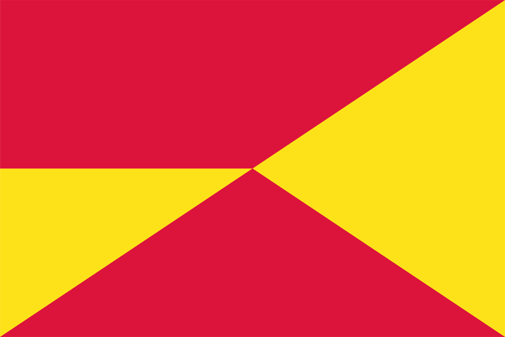

# Procesverslag
**Auteur:** -jouw naam-

**URL site:** -url naar je website-

## Bronnenlijst
1. bron 1
2. bron 2
3. ...

## Eindgesprek (week 7/8)

## Voortgang 3 (week 6)

-same as voortgang 1-

## Voortgang 2 (week 5)

-same as voortgang 1-

## Voortgang 1 (week 3)

### Stand van zaken

-dit ging goed dit was lastig-

**Screenshot(s):**

-screenshot(s) van hoe ver je bent-

### Agenda voor meeting

-samen met je groephe opstellen-

### Verslag van meeting

-na afloop opstellen-

## Intake

**Je startniveau:** -kies uit zwart, rood óf blauw-

**Je focus:** -kies uit responsive óf surface plane-

**Je opdracht:** -link naar de website die je gaan namaken óf de naam van je eigen ontwerp-

**Screenshot(s):**

**Breakdown-schets:**

